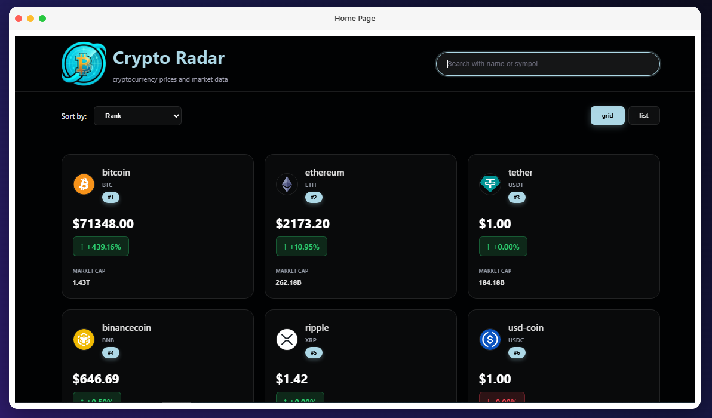
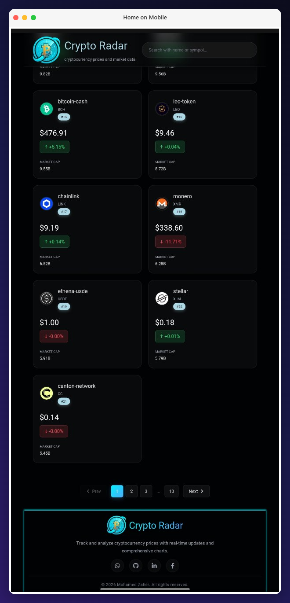
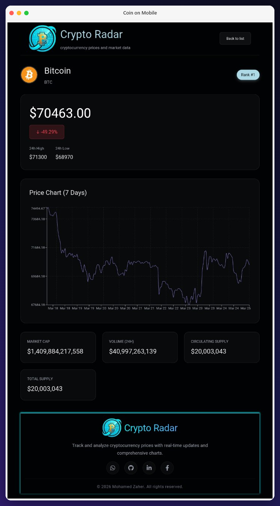
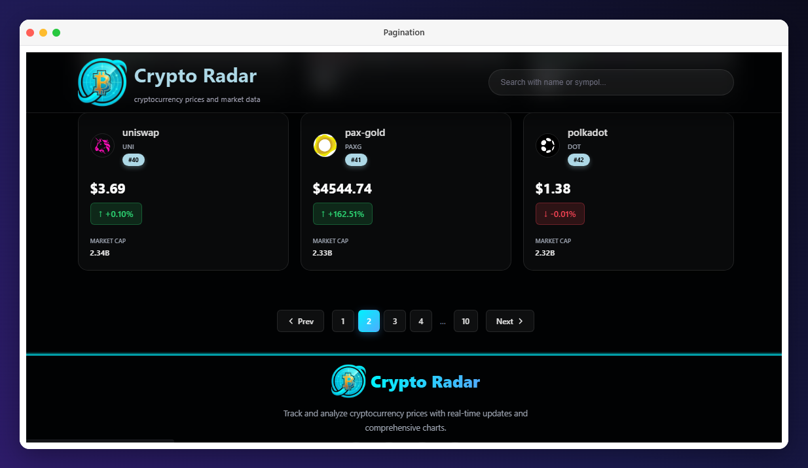
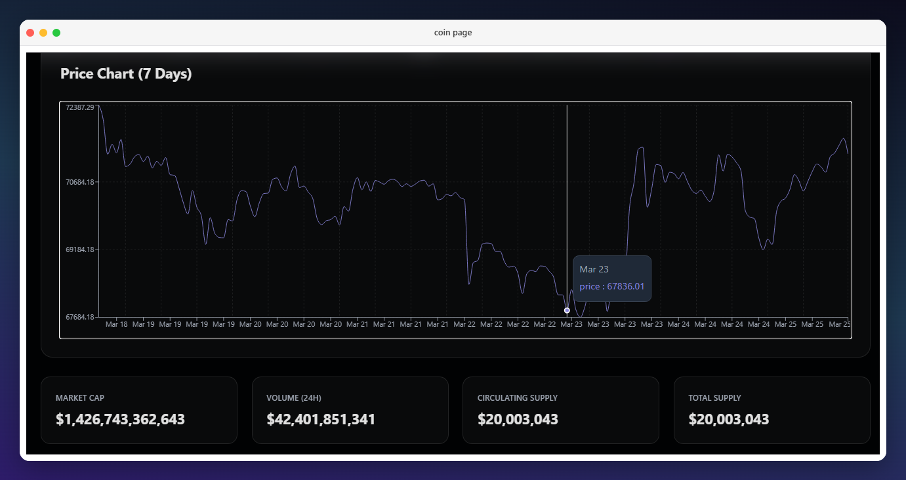

# 🚀 Crypto Coins Tracker

A modern **cryptocurrency tracking web application** that allows users to explore real-time data about different cryptocurrencies, including prices, market trends, and detailed coin information.

---

### 🌐 Features

- 📊 Real-time cryptocurrency price tracking
- 🔍 Search for any cryptocurrency
- 📄 Pagination for better performance and user experience
- 📈 Interactive charts using Recharts
- 💹 View detailed coin information (price, market cap, rank, etc.)
- ⚡ Fast API data handling using native Fetch API (no external data-fetch library)
- 📱 Fully responsive UI

---

### 🛠️ Tech Stack

  
  
  
  
  

---
## 📸 Screenshots

### 🏠 Home Page

  

---

  

    <h4>🏠 Home Page (Mobile)</h4>
    
  

  

    <h4>🏠 Coin Details Page (Mobile)</h4>
    
  

---

### 📄 Pagination Example

---

### 📈 Charts (Recharts)

---

### 👨‍💻 Author

**Mohamed Zaher**  
Frontend & Full-Stack Developer  
[GitHub](https://github.com/MoZaher2) | [LinkedIn](https://www.linkedin.com/in/mohamedzaher-dev)